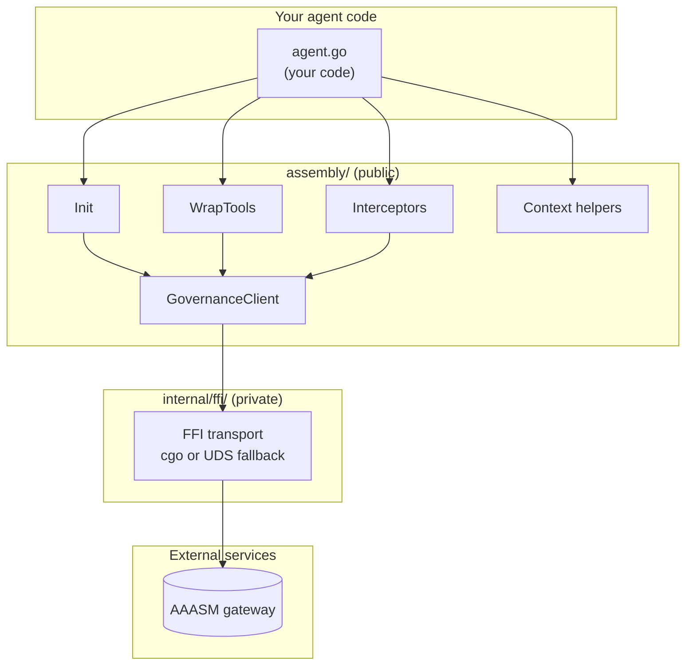

# Architecture

This page describes how `go-sdk` is organised internally — the module layout,
the dual-mode FFI bridge to the Rust governance library, the HTTP and gRPC
interceptor flow, the context-propagation design, and how tool wrapping
threads governance checks around your agent's tool calls. Read it after
[Getting Started](getting-started/) when you want to know *why* the SDK is
shaped the way it is.

## Module Structure

The SDK has exactly **one public package** and one internal helper:

```text
assembly/                       # public API — import this from your code
├── init.go                     # Init entry point
├── runtime.go                  # Assembly type + lifecycle
├── options.go                  # functional options (WithGatewayURL, …)
├── governance_client.go        # GovernanceClient interface
├── gateway_client.go           # default GovernanceClient implementation
├── policy_model.go             # CheckRequest / Decision / RecordRequest
├── governance_errors.go        # ErrRuntimeNotInitialized, PolicyViolationError
├── tool_wrapper.go             # AssemblyTool — single-tool governance wrapper
├── wrap_tools.go               # WrapTools — slice-level convenience
├── interceptor.go              # HTTPMiddleware + gRPC interceptors
├── context.go                  # AgentID/TraceID/RunID propagation
├── sidecar.go                  # local sidecar lifecycle
└── …

internal/ffi/                   # private — low-level transport, see CGo FFI Bridge below
```

Anything outside `assembly/` is internal and may change without notice. The
[Tool Wrapping](#tool-wrapping) and [Context Propagation](#context-propagation)
sections below describe how the public types compose at runtime.



## CGo FFI Bridge

`internal/ffi/` is the seam between the Go SDK and the Rust governance
runtime. It ships **two interchangeable transport implementations** selected
at compile time by build tags, so the rest of the SDK never has to care which
one is in use.

| Mode | Selected when | Source file | What it does |
|---|---|---|---|
| **Native (CGo)** | `-tags aa_ffi_go` *and* `CGO_ENABLED=1` | `cgo_bridge.go` | Links against `libaa_ffi_go` and calls into the Rust runtime in-process. Lowest latency. |
| **Pure-Go fallback** *(default)* | `aa_ffi_go` tag unset, *or* `CGO_ENABLED=0` | `fallback_uds_nocgo.go` | Connects to the local sidecar over a Unix domain socket. No C toolchain required. |

The dispatch lives in the build-tag-gated `binding_select_cgo.go` and
`binding_select_fallback.go` files. Each compilation unit picks one or the
other depending on the active build tags, so there is exactly one symbol
named `Client` (or whatever the active path exports) at link time.

CI exercises both lanes in the matrix (`CGO_ENABLED` 0 and 1), so a change to
either transport that breaks the other will fail before merge.
