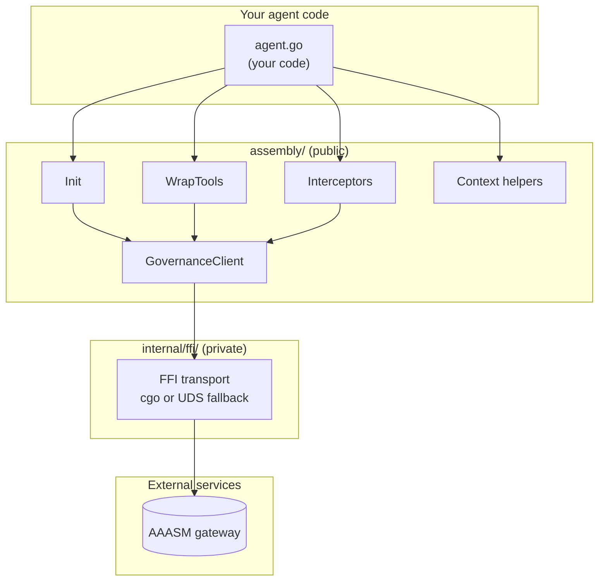
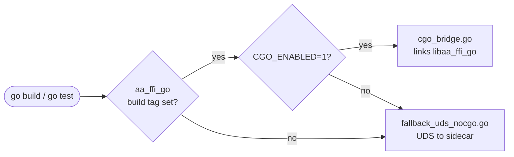
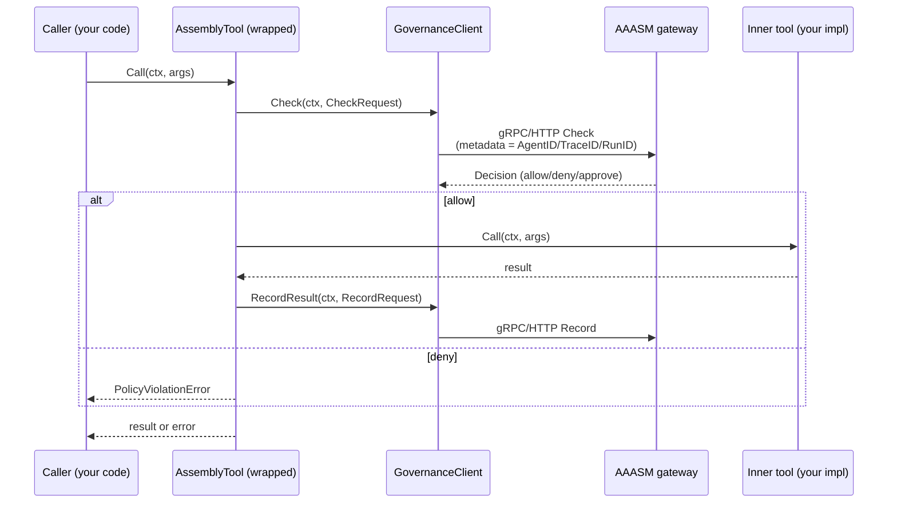

# Architecture

This page describes how `go-sdk` is organised internally — the module layout,
the dual-mode FFI bridge to the Rust governance library, the HTTP and gRPC
interceptor flow, the context-propagation design, and how tool wrapping
threads governance checks around your agent's tool calls. Read it after
[Getting Started](getting-started/) when you want to know *why* the SDK is
shaped the way it is.

## Module Structure

The SDK has exactly **one public package** and one internal helper:

```text
assembly/                       # public API — import this from your code
├── init.go                     # Init entry point
├── runtime.go                  # Assembly type + lifecycle
├── options.go                  # functional options (WithGatewayURL, …)
├── governance_client.go        # GovernanceClient interface
├── gateway_client.go           # default GovernanceClient implementation
├── policy_model.go             # CheckRequest / Decision / RecordRequest
├── governance_errors.go        # ErrRuntimeNotInitialized, PolicyViolationError
├── tool_wrapper.go             # AssemblyTool — single-tool governance wrapper
├── wrap_tools.go               # WrapTools — slice-level convenience
├── interceptor.go              # HTTPMiddleware + gRPC interceptors
├── context.go                  # AgentID/TraceID/RunID propagation
├── sidecar.go                  # local sidecar lifecycle
└── …

internal/ffi/                   # private — low-level transport, see CGo FFI Bridge below
```

Anything outside `assembly/` is internal and may change without notice. The
[Tool Wrapping](#tool-wrapping) and [Context Propagation](#context-propagation)
sections below describe how the public types compose at runtime.



## CGo FFI Bridge

`internal/ffi/` is the seam between the Go SDK and the Rust governance
runtime. It ships **two interchangeable transport implementations** selected
at compile time by build tags, so the rest of the SDK never has to care which
one is in use.

| Mode | Selected when | Source file | What it does |
|---|---|---|---|
| **Native (CGo)** | `-tags aa_ffi_go` *and* `CGO_ENABLED=1` | `cgo_bridge.go` | Links against `libaa_ffi_go` and calls into the Rust runtime in-process. Lowest latency. |
| **Pure-Go fallback** *(default)* | `aa_ffi_go` tag unset, *or* `CGO_ENABLED=0` | `fallback_uds_nocgo.go` | Connects to the local sidecar over a Unix domain socket. No C toolchain required. |

The dispatch lives in the build-tag-gated `binding_select_cgo.go` and
`binding_select_fallback.go` files. Each compilation unit picks one or the
other depending on the active build tags, so there is exactly one symbol
named `Client` (or whatever the active path exports) at link time.

CI exercises both lanes in the matrix (`CGO_ENABLED` 0 and 1), so a change to
either transport that breaks the other will fail before merge.



The fallback path is the default in container images and CI lanes that
disable CGo, which is most of them. Reach for the native path only when the
in-process latency saving matters.

## HTTP and gRPC Interceptors

The interceptors in `assembly/interceptor.go` let governance-relevant metadata
flow across process boundaries without your tool code having to know about
it.

- **`HTTPMiddleware(next http.RoundTripper)`** wraps an outbound HTTP
  transport. It reads `AgentID`, `TraceID`, and `RunID` from the request's
  `context.Context` and writes them to outgoing headers, so the receiving
  service can resume the chain on the other side.
- **`UnaryClientInterceptor()`** and **`StreamClientInterceptor()`** are the
  gRPC equivalents. They attach the same identifiers as gRPC metadata.

These run at the **outbound** edge of your process. On the **inbound** side,
a corresponding server-side interceptor (in your service framework, not in
this SDK) reads the metadata back into `context.Context`, which makes the
chain usable by the next governance check.

The interceptors are intentionally narrow — they only move metadata. Policy
enforcement (deny / allow / approval) happens in `GovernanceClient.Check`,
called by the wrapped tool, not by the interceptor.



This sequence applies to *every* call against a tool produced by `WrapTools`.
The interceptors plus context propagation (next section) make sure the
governance metadata follows the call across whatever wire it crosses.

## Context Propagation

Three identifiers travel through `context.Context` for the lifetime of a
governed call:

| Identifier | Setter | Reader | Purpose |
|---|---|---|---|
| **AgentID** | `WithAgentID(ctx, id)` | `AgentIDFromContext(ctx)` | Names the calling agent so the gateway can attribute every check + record to it. |
| **TraceID** | `WithTraceID(ctx, id)` | `TraceIDFromContext(ctx)` | Correlates work across SDK boundaries. Falls back to the OpenTelemetry span context's trace ID when unset. |
| **RunID** | `WithRunID(ctx, id)` | `RunIDFromContext(ctx)` | Groups calls that belong to one logical agent run. `EnsureRunID(ctx)` returns a context guaranteed to carry one (creating it if absent). |

All three are private context keys — there is no public type surface that lets
external code accidentally collide with them. They are propagated **on the
wire** by the interceptors (see previous section) so a downstream service
that re-reads them sees the same identifiers the upstream caller set.

The fallbacks are deliberate:

- `TraceIDFromContext` falls back to `trace.SpanContextFromContext(ctx).TraceID()`
  so OpenTelemetry-instrumented code does not have to set the trace ID
  twice.
- `RunIDFromContext` returns an empty string when no run ID is present;
  `EnsureRunID` is the helper that guarantees one.
