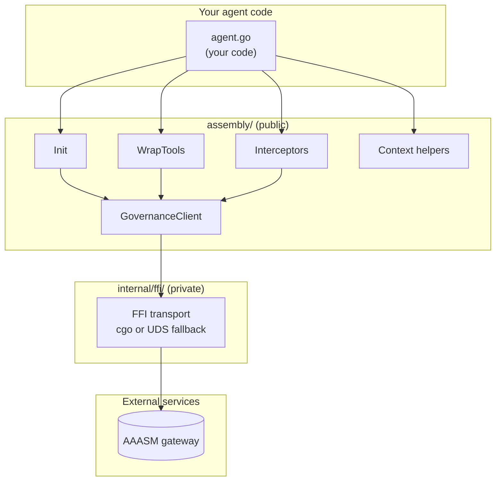

# Architecture

This page describes how `go-sdk` is organised internally — the module layout,
the dual-mode FFI bridge to the Rust governance library, the HTTP and gRPC
interceptor flow, the context-propagation design, and how tool wrapping
threads governance checks around your agent's tool calls. Read it after
[Getting Started](getting-started/) when you want to know *why* the SDK is
shaped the way it is.

## Module Structure

The SDK has exactly **one public package** and one internal helper:

```text
assembly/                       # public API — import this from your code
├── init.go                     # Init entry point
├── runtime.go                  # Assembly type + lifecycle
├── options.go                  # functional options (WithGatewayURL, …)
├── governance_client.go        # GovernanceClient interface
├── gateway_client.go           # default GovernanceClient implementation
├── policy_model.go             # CheckRequest / Decision / RecordRequest
├── governance_errors.go        # ErrRuntimeNotInitialized, PolicyViolationError
├── tool_wrapper.go             # AssemblyTool — single-tool governance wrapper
├── wrap_tools.go               # WrapTools — slice-level convenience
├── interceptor.go              # HTTPMiddleware + gRPC interceptors
├── context.go                  # AgentID/TraceID/RunID propagation
├── sidecar.go                  # local sidecar lifecycle
└── …

internal/ffi/                   # private — low-level transport, see CGo FFI Bridge below
```

Anything outside `assembly/` is internal and may change without notice. The
[Tool Wrapping](#tool-wrapping) and [Context Propagation](#context-propagation)
sections below describe how the public types compose at runtime.


