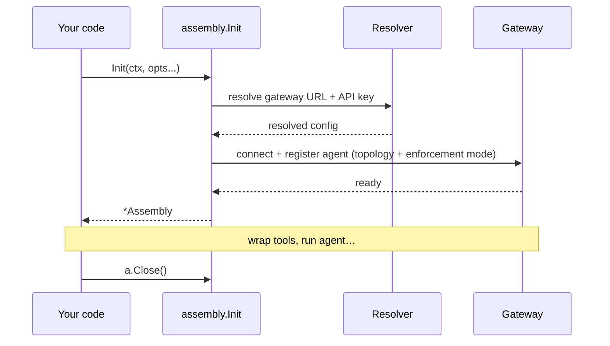
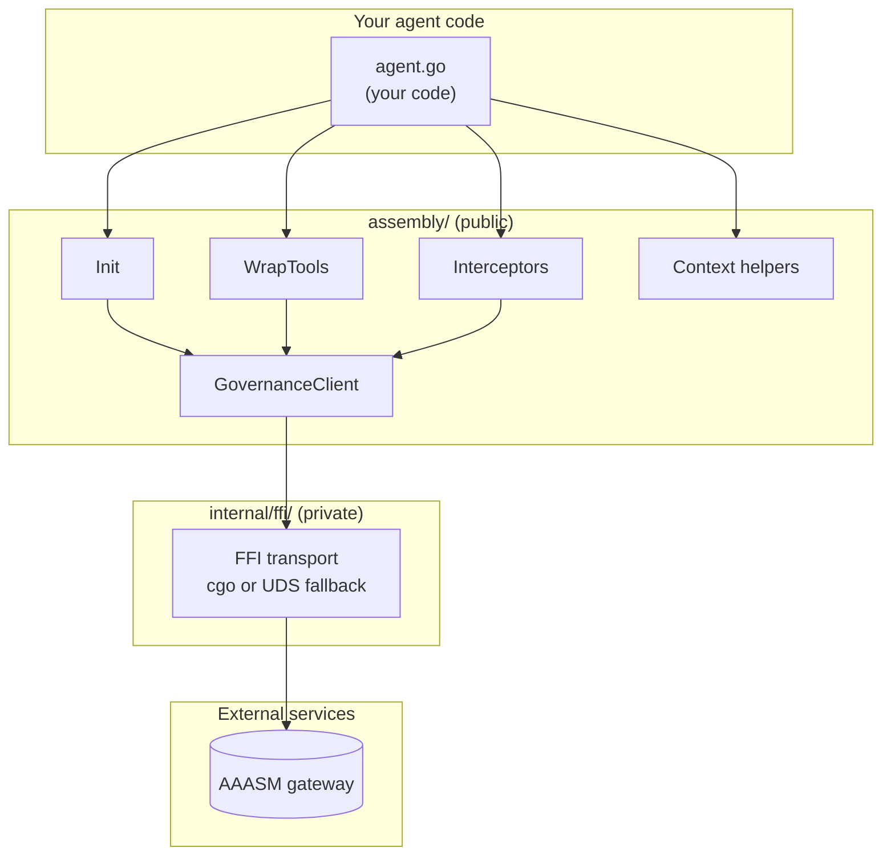
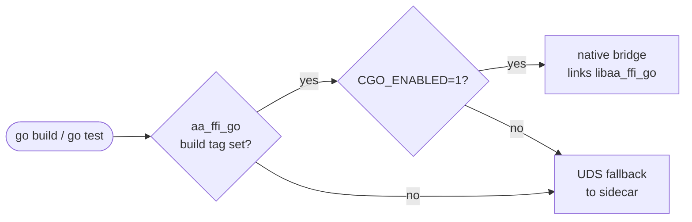
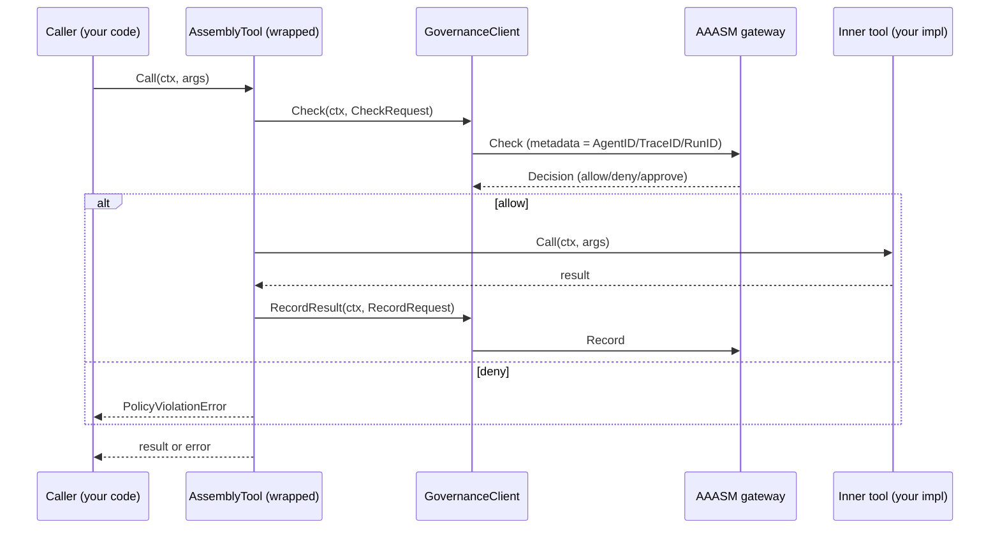

# Core Concepts

Read this after the [Quick Start]() when you want to understand
*how* the SDK works — how it talks to the gateway, the lifecycle of the runtime
handle, what enforcement actually means, and how the SDK is shaped internally.

## How the SDK talks to the gateway

The SDK never makes a policy decision itself. It is a **client** of the AI Agent
Assembly **gateway** — the policy brain that lives in the
[agent-assembly](https://github.com/ai-agent-assembly/agent-assembly) core repo.
Every governed tool call results in two messages to the gateway:

1. A **`Check`** before the tool runs — the gateway returns a `Decision`
   (allow, deny, or "pending approval").
2. A **`RecordResult`** after the tool runs — the gateway records the outcome
   for audit, budgeting, and topology.

These travel over the gateway's wire protocol (gRPC/HTTP). For how the gateway
itself is built — registry, policy engine, budgets, and the three interception
layers the SDK is one of — see the core
[Architecture overview](https://docs.agent-assembly.com/core/).

Your code talks to the gateway through one small interface, `GovernanceClient`:

```go
type GovernanceClient interface {
    Check(ctx context.Context, request CheckRequest) (Decision, error)
    WaitForApproval(ctx context.Context, request ApprovalRequest) (Decision, error)
    RecordResult(ctx context.Context, request RecordRequest) error
    Close() error
}
```

`WrapTools` takes a value of this interface as its second argument. When you
pass `nil`, the wrapper is a passthrough — tools run, no gateway calls are made
— which is handy for getting the integration in place before you wire policy.

## The Assembly runtime and its lifecycle

`assembly.Init(ctx, opts...)` returns an `*assembly.Assembly` — your runtime
handle. Its lifecycle is deliberately simple:

1. **Resolve** — `Init` resolves the gateway URL and API key through a fixed
   precedence chain (option → env → config file → local default). See
   [Configuration]().
2. **Boot** — it validates the resolved options, optionally launches a managed
   sidecar (when `WithSidecarBinary` is set), connects, and registers the agent
   with the gateway, carrying any topology fields (`WithTeamID`,
   `WithParentAgentID`, …) and the enforcement mode.
3. **Use** — you wrap tools and run your agent. The handle is safe to share.
4. **Close** — `a.Close()` stops a managed sidecar (if any) and releases the
   runtime. Always `defer a.Close()`.

Registration is **implicit**: there is no separate `RegisterAgent` call. `Init`
emits the registration event for you as part of boot, derived from the options
you passed.


**In the default pure-Go build this registration step is currently a no-op.**
`Init` connects and governs tool calls, but the register handshake fires *only*
under the opt-in native cgo binding (`-tags aa_ffi_go`, `CGO_ENABLED=1`), whose
native library (`libaa_ffi_go`) is **not published** — so a plain `go get` agent
does not appear in the dashboard, even with
[`WithSidecarAddress`](https://pkg.go.dev/github.com/ai-agent-assembly/go-sdk/assembly#WithSidecarAddress)
set. See the [Quick Start]() note and
[AAASM-4547](https://lightning-dust-mite.atlassian.net/browse/AAASM-4547).




## Modes and enforcement

Two independent knobs decide what happens when a governed tool is called.

**Enforcement mode** (`WithEnforcementMode`) is the per-agent posture the
gateway applies to decisions:

| Mode | Token | What the gateway does |
|---|---|---|
| `EnforcementModeEnforce` | `enforce` | Default. A `deny` blocks the action; `redact` strips secrets. |
| `EnforcementModeObserve` | `observe` | Dry-run. Records what *would* have happened, but lets every action through. |
| `EnforcementModeDisabled` | `disabled` | Policy evaluation skipped entirely. |

When you don't set this option the field is omitted from registration and the
gateway applies its own server-side default (live enforce).

**Failure mode** (`WithFailClosed`) decides what happens when the SDK *can't
reach* the gateway to get a decision:

- `WithFailClosed(true)` *(default)* — a check failure **blocks** the call
  (fail-closed / fail-safe).
- `WithFailClosed(false)` — the call **proceeds** when the gateway is
  unreachable (fail-open).

These compose: enforcement mode governs decisions the gateway *makes*; failure
mode governs what happens when no decision *arrives*.

> The SDK is the lowest-latency of three interception layers, not a trust
> boundary on its own — the gateway is authoritative. See the core
> [Security Model](https://docs.agent-assembly.com/core/) for how
> the SDK, sidecar proxy, and eBPF layers combine to catch bypass attempts.

## Module structure

The SDK has exactly **one public package** and one internal helper:

```text
assembly/                       # public API — import this from your code
├── init.go                     # Init entry point
├── runtime.go                  # Assembly type + lifecycle
├── options.go                  # functional options (WithGatewayURL, …)
├── governance_client.go        # GovernanceClient interface
├── gateway_client.go           # GatewayClient — transport-backed Check helper
├── policy_model.go             # CheckRequest / Decision / RecordRequest
├── governance_errors.go        # ErrRuntimeNotInitialized, PolicyViolationError
├── tool_wrapper.go             # AssemblyTool — single-tool governance wrapper
├── wrap_tools.go               # WrapTools — slice-level convenience
├── interceptor.go              # HTTPMiddleware + gRPC interceptors
├── context.go                  # AgentID/TraceID/RunID propagation
├── sidecar.go                  # local sidecar lifecycle
└── …

internal/ffi/                   # private — low-level transport, see below
```

Anything outside `assembly/` is internal and may change without notice.



## The FFI transport bridge

`internal/ffi/` is the seam between the Go SDK and the Rust governance runtime.
It ships **two interchangeable transport implementations** selected at compile
time by build tags, so the rest of the SDK never has to care which one is in
use:

| Mode | Selected when | What it does |
|---|---|---|
| **Native (CGo)** | `-tags aa_ffi_go` *and* `CGO_ENABLED=1` | Links against `libaa_ffi_go` and calls into the Rust runtime in-process. Lowest latency. |
| **Pure-Go fallback** *(default)* | `aa_ffi_go` tag unset, *or* `CGO_ENABLED=0` | Connects to the local sidecar over a Unix domain socket. No C toolchain required. |

CI exercises both lanes (`CGO_ENABLED` 0 and 1), so a change to either transport
that breaks the other fails before merge. The fallback path is the default in
container images and most CI lanes; reach for the native path only when the
in-process latency saving matters.



## HTTP and gRPC interceptors

The interceptors in `assembly/interceptor.go` let governance-relevant metadata
flow across process boundaries without your tool code having to know about it:

- **`HTTPMiddleware(next http.RoundTripper)`** wraps an outbound HTTP transport.
  It reads `AgentID`, `TraceID`, and `RunID` from the request's
  `context.Context` and writes them to outgoing headers, so the receiving
  service can resume the chain.
- **`UnaryClientInterceptor()`** and **`StreamClientInterceptor()`** are the
  gRPC equivalents, attaching the same identifiers as gRPC metadata.

These run at the **outbound** edge of your process. The interceptors are
intentionally narrow — they only move metadata. Policy enforcement happens in
`GovernanceClient.Check`, called by the wrapped tool, not by the interceptor.



## Context propagation

Three identifiers travel through `context.Context` for the lifetime of a
governed call:

| Identifier | Setter | Reader | Purpose |
|---|---|---|---|
| **AgentID** | `WithAgentID(ctx, id)` | `AgentIDFromContext(ctx)` | Names the calling agent so the gateway can attribute every check + record to it. |
| **TraceID** | `WithTraceID(ctx, id)` | `TraceIDFromContext(ctx)` | Correlates work across SDK boundaries. Falls back to the OpenTelemetry span context's trace ID when unset. |
| **RunID** | `WithRunID(ctx, id)` | `RunIDFromContext(ctx)` | Groups calls that belong to one logical agent run. `EnsureRunID(ctx)` returns a context guaranteed to carry one. |

All three are private context keys — no public type surface lets external code
collide with them. They are propagated **on the wire** by the interceptors so a
downstream service that re-reads them sees the same identifiers the upstream
caller set.

## Tool wrapping

`WrapTools` turns a slice of plain `Tool`s into a slice of governed tools. Each
wrapped tool runs `GovernanceClient.Check` *before* execution and
`GovernanceClient.RecordResult` *after*:

```go
inner := []assembly.Tool{searchWebTool, runShellTool}
wrapped := assembly.WrapTools(inner, client) // client is your GovernanceClient (or nil)
```

Two design points worth knowing:

- **`WrapTools` does not enforce policy itself.** It delegates to the governance
  client, which calls the gateway, which makes the decision.
- **Failure mode is configurable** via `WithFailClosed` (see
  [Modes and enforcement](#modes-and-enforcement)).

The single-tool path (`AssemblyTool` + `NewAssemblyTool`) is exported for the
rare case where you need to wrap one tool in isolation — for example, inside
another framework's registry that reaches in one tool at a time. For everything
else, prefer `WrapTools`.
