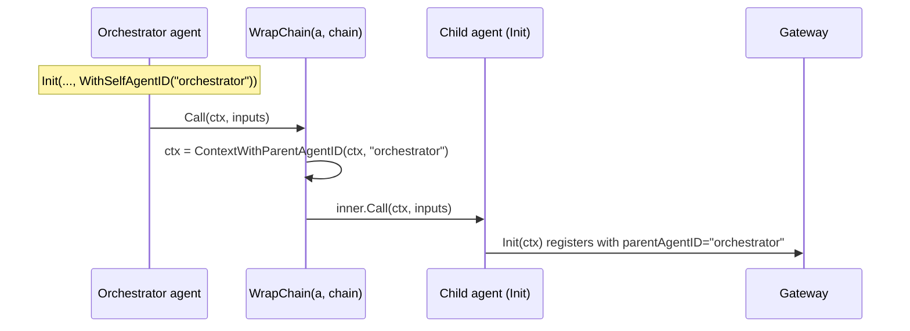

# Integrate with a framework

Most Go agents are built on top of a framework that has its own notion of
"tools" and "chains". This guide shows how to slot the SDK into that shape
without taking on the framework as a dependency, and how to keep agent **lineage**
(who spawned whom) flowing when one agent calls another.

## Adapting framework tools

The SDK's `Tool` interface is intentionally minimal so it adapts cleanly to most
frameworks:

```go
type Tool interface {
    Name() string
    Description() string
    Call(ctx context.Context, input string) (string, error)
}
```

If your framework's tool type already exposes a name, description, and a
context-aware call, satisfy the interface directly. Otherwise write a one-struct
adapter per tool and pass the adapted slice to `WrapTools`. See
[Govern an agent's tools](../govern-an-agents-tools/) for the wrapping mechanics.

## Wrapping chains (langchaingo-style)

The SDK ships a framework-agnostic `Chain` interface that matches the shape of
`github.com/tmc/langchaingo/chains.Chain` **without importing it**:

```go
type Chain interface {
    Call(ctx context.Context, inputs map[string]any) (map[string]any, error)
}
```

Any value whose `Call` has that signature satisfies it. Wrap a chain with
`WrapChain` so that every call carries this agent's identity as the
**parentAgentID** in context:

```go
// a is the *Assembly returned by Init, created WithSelfAgentID("orchestrator").
governed := assembly.WrapChain(a, myChain)

out, err := governed.Call(ctx, inputs)
```

`WrapChain(a, chain)` returns a `Chain` that, on each `Call`, injects
`a`'s own agent ID into the context as the parent agent ID before delegating to
the inner chain. Its signature is:

```go
func WrapChain(a *Assembly, chain Chain) Chain
```

## How lineage propagates

The reason `WrapChain` matters: when a child agent inside that chain calls
`assembly.Init(ctx, ...)`, it **auto-inherits** its parent from the context —
you don't have to thread `WithParentAgentID` by hand.



For this to work the orchestrator's `Assembly` must carry a self agent ID, set
with `WithSelfAgentID`:

```go
a, err := assembly.Init(ctx,
    assembly.WithSelfAgentID("orchestrator"),
    // ... gateway options ...
)
```

**Pass-through safety:** if the `Assembly` has no self agent ID, `WrapChain`
leaves the context untouched and calls the inner chain unchanged — so adding it
is always safe.

## Setting lineage explicitly

When you're not using `WrapChain` — for example, a child agent spawned out of
band — set the topology fields directly on the child's `Init`:

```go
child, err := assembly.Init(ctx,
    assembly.WithParentAgentID("orchestrator"),
    assembly.WithSpawnedByTool("delegate_research"),
    assembly.WithDelegationReason("needs a deeper web search"),
    assembly.WithTeamID("research"),
)
```

These flow to the gateway at registration and let it reconstruct the agent
topology. See [Configuration](../../configuration/#optional-options) for the full
list.

## Next

- [Handle allow/deny decisions and errors](../handle-decisions-and-errors/) —
  reacting to the gateway's decisions.
- [Configuration](../../configuration/) — every option and the resolution order.
